# BSN Labs: Baseband and Passband Communication Systems
> GNU Radio simulations for digital communications — TH Köln, Communication Systems and Networks

---

## Repo Structure

```text
bsn-labs/
│
├── lab1-bipolar-nrz/
│   ├── BipolarNRZrect.grc              # Rectangular pulse shape simulation
│   ├── BipolarNRZ.grc                  # RRCS pulse shape simulation
│   ├── BipolarResamplingInRRCS.grc     # RRCS with integrated up/downsampling
│   └── lab-bipolar-nrz.pdf             # Lab sheet
│
├── lab2-iq-modulation/
│   ├── QPSK.grc                        # QPSK IQ modulation & demodulation
│   └── lab-iq-modulation.pdf           # Lab sheet
│
├── lab3-[name]/                        # To be added
│   ├── *.ipynb
│   └── lab-sheet.pdf
│
├── .gitignore
└── README.md
```

---

##  Lab 1.1 — Bipolar NRZ Baseband Communication

**Topic:** Binary baseband transmission using Bipolar Non-Return-to-Zero (NRZ) line codes over an AWGN channel with matched filtering.

### 



```mermaid
flowchart LR
    %% Define Signals and Components
    In(["a[k] <br> (Input Symbols)"])
    Pulse["Pulse Shaping Filter <br> p(t)"]
    SumNode((("+")))
    Noise(["n(t) <br> (AWGN Noise)"])
    Matched["Matched Filter <br> h(t) = p(-t)"]
    Sampler["Sampler <br> t = kT"]
    Decision["Decision Device <br> (Threshold)"]
    Out(["â[k] <br> (Estimated Symbols)"])

    %% Signal Flow
    In --> Pulse
    Pulse --> SumNode
    Noise --> SumNode
    SumNode --> Matched
    Matched --> Sampler
    Sampler --> Decision
    Decision --> Out

    %% Styling
    style SumNode fill:#1f2937,stroke:#38bdf8,stroke-width:2px
    style Sampler fill:#1f2937,stroke:#fbbf24,stroke-width:1px
```

The transmit symbols `a[k] ∈ {±1}` are pulse-shaped, transmitted through an AWGN channel, and recovered using a matched filter followed by a threshold decision device.

### GNU Radio Flowgraphs

| File | Description |
|---|---|
| `BipolarNRZrect.grc` | Rectangular pulse shape — simple but causes large spectral sidelobes (sinc spectrum) |
| `BipolarNRZ.grc` | Root-Raised Cosine (RRCS) pulse — bandwidth-efficient, ISI-free (Nyquist criterion) |
| `BipolarResamplingInRRCS.grc` | RRCS with integrated up/downsampling inside the filter blocks |

### Key Concepts

- **Samples per symbol (SPS):** `N = 8`, sampling rate `rs = N × r = 96 kHz`
- **Matched filter:** `h[n] = p[-n]` — maximises SNR at decision point
- **Eye diagram:** used to visualise ISI and noise margin
- **BER vs SNR:** at 40 dB SNR → virtually no errors; at 10 dB → BER < 10⁻³; at 0 dB → eye fully closed
- **Rectangular vs RRCS:** same BER at equal SNR when Nyquist criterion is met — pulse shape does not affect BER if ISI = 0

### How to Run

```bash
gnuradio-companion BipolarNRZrect.grc   # Part 1: Rect pulse
gnuradio-companion BipolarNRZ.grc       # Part 2: RRCS pulse
gnuradio-companion BipolarResamplingInRRCS.grc  # Part 3: RRCS with resampling
```

---

## Lab 1.2 — IQ Modulation and Demodulation (QPSK)

**Topic:** Upconversion and downconversion between baseband and passband using IQ modulation, demonstrated with a QPSK-like communication system.

### 


```mermaid
flowchart LR
    %% Inputs
    SI(["sI(t) <br> (In-phase)"])
    SQ(["sQ(t) <br> (Quadrature)"])

    %% Local Oscillators / Mixers
    MixI((("×")))
    MixQ((("×")))
    Cos["cos(2πf₀t)"]
    Sin["-sin(2πf₀t)"]

    %% Adder & Output (Fixed: No spaces in Node ID!)
    SumNode((("+")))
    Out(["s(t) <br> (Passband Signal)"])

    %% Connections
    SI --> MixI
    Cos --> MixI
    
    SQ --> MixQ
    Sin --> MixQ

    MixI --> SumNode
    MixQ --> SumNode
    SumNode --> Out

    %% Styling
    style MixI fill:#111827,stroke:#38bdf8,stroke-width:1px
    style MixQ fill:#111827,stroke:#38bdf8,stroke-width:1px
    style SumNode fill:#1f2937,stroke:#34d399,stroke-width:2px
```

**IQ Demodulator (Receiver — passband → baseband):**

```mermaid
flowchart LR
    %% Input Signal
    R(["r(t) <br> (Passband Input)"])

    %% Demodulation Paths
    MixI((("×")))
    MixQ((("×")))
    Cos["cos(2πf₀t)"]
    Sin["-sin(2πf₀t)"]

    %% Filtering Stage
    LPFI["Low-Pass Filter <br> (LPF)"]
    LPFQ["Low-Pass Filter <br> (LPF)"]

    %% Outputs
    OutI(["½ sI(t) <br> (Recovered In-phase)"])
    OutQ(["½ sQ(t) <br> (Recovered Quadrature)"])

    %% Structural Paths
    R --> MixI
    Cos --> MixI
    MixI --> LPFI
    LPFI --> OutI

    R --> MixQ
    Sin --> MixQ
    MixQ --> LPFQ
    LPFQ --> OutQ

    %% Styling
    style MixI fill:#111827,stroke:#fbbf24,stroke-width:1px
    style MixQ fill:#111827,stroke:#fbbf24,stroke-width:1px
    style LPFI fill:#1f2937,stroke:#38bdf8,stroke-width:1px
    style LPFQ fill:#1f2937,stroke:#38bdf8,stroke-width:1px
```



The inphase `sI(t)` and quadrature `sQ(t)` components carry two independent data streams simultaneously — possible because `cos(2πf₀t)` and `-sin(2πf₀t)` are orthogonal carriers.

### GNU Radio Flowgraph

| File | Description |
|---|---|
| `QPSK.grc` | Full QPSK-like IQ mod/demod chain (no AWGN — focuses on IQ structure) |

### Key Concepts

- **Equivalent lowpass signal:** `sL(t) = sI(t) + j·sQ(t)` — complex-valued baseband representation
- **Upconversion:** `s(t) = Re{sL(t)·e^j2πf₀t} = sI(t)cos(2πf₀t) - sQ(t)sin(2πf₀t)`
- **IQ-crosstalk:** only absent when Tx and Rx oscillators are phase-synchronous
- **Spectrum relationship:** `S(f) = [SL(f-f₀) + SL*(-f-f₀)] / 2`
- **Amplitude scaling:** IQ demodulation introduces a ½ factor — must be compensated in the receiver filter
- **RRCS as LPF:** the matched filter also suppresses the double-frequency components at `2f₀`

### How to Run

```bash
gnuradio-companion QPSK.grc
```

Adjust the `Delay` slider until Tx and Rx symbol sequences align. Examine the **Frequency Domain** and **Constellation** tabs.

---

##  Requirements

- GNU Radio ≥ 3.10
- Python ≥ 3.8
- numpy (`import numpy as np` used inside flowgraphs)

Install GNU Radio on Ubuntu/Debian:
```bash
sudo apt install gnuradio
```

On macOS (via Homebrew):
```bash
brew install gnuradio
```

---

##  .gitignore Notes

Auto-generated Python files (`.py`) exported by GNU Radio Companion and checkpoint files are excluded. Only the `.grc` source files are committed — these are all that's needed to open and re-run the simulations.

---

**Course:** Broadband Switching Networks (BSN) — TH Köln  
**Author:** Harald Elders-Boll (lab design) | Student simulations & analysis
# digital-communications-labs
